基于 Spring Boot 的电影院购票系统（程序+论文）
=

### 完整代码获取地址：从戎源码网 ([https://armycodes.com/](https://armycodes.com/))
### 作者微信：19941326836  QQ：952045282 
### 承接计算机毕业设计、Java毕业设计、Python毕业设计、深度学习、机器学习
### 选题+开题报告+任务书+程序定制+安装调试+论文+答辩ppt 一条龙服务
### 所有选题地址https://github.com/nature924/allProject

一、项目介绍
---
基于SpringBoot框架的电影院购票系统，系统角色为管理员、用户，主要功能如下

管理员：
基本操作：登录、修改密码、获取个人信息、修改个人信息、退出登录
电影管理：筛选电影、获取电影列表、查看电影详情、新增电影、修改电影信息、删除电影
电影订单管理：获取订单列表、查看订单详情、修改订单信息、发货、收货、删除订单
电影收藏管理：获取收藏列表、查看收藏详情、删除收藏记录
电影评价管理：获取评价列表、查看评价详情、回复评价、删除评价
用户管理：筛选用户信息、查看用户详情、新增用户、修改用户信息、删除用户、重置密码
后台账户管理：筛选管理员账户、查看账户详情、新增账户、修改账户、删除账户、重置密码
论坛管理：获取帖子列表、查看帖子详情、发布帖子、编辑帖子、删除帖子
新闻管理：发布新闻、获取新闻列表、查看新闻详情、修改新闻、删除新闻

用户：
基本操作：登录、注册、修改密码、获取个人信息、修改个人信息、退出登录
电影浏览与收藏：浏览电影列表、筛选电影、查看电影详情、收藏电影、取消收藏、查看我的收藏
购票下单与支付：选择座位下单、余额支付、查看支付结果
订单管理：查看订单列表、查看订单详情、申请退款、查看订单状态
评价管理：对已购电影发表评价、查看我的评价
论坛互动：发布帖子、浏览帖子、查看帖子详情
新闻公告：浏览新闻列表、查看新闻详情

二、项目技术
---
- 编程语言：Java
- 数据库：MySQL
- 项目管理工具：Maven
- 前端技术：VUE、HTML、Jquery、Bootstrap
- 后端技术：Spring、SpringMVC、MyBatis

三、运行环境
---
- 操作系统：Windows、macOS都可以
- JDK版本：JDK1.8以上都可以
- 开发工具：IDEA、Ecplise、Myecplise都可以
- 数据库: MySQL5.7以上都可以
- Tomcat：任意版本都可以
- Maven：任意版本都可以

四、运行截图
---
### 论文截图：

### 程序截图：
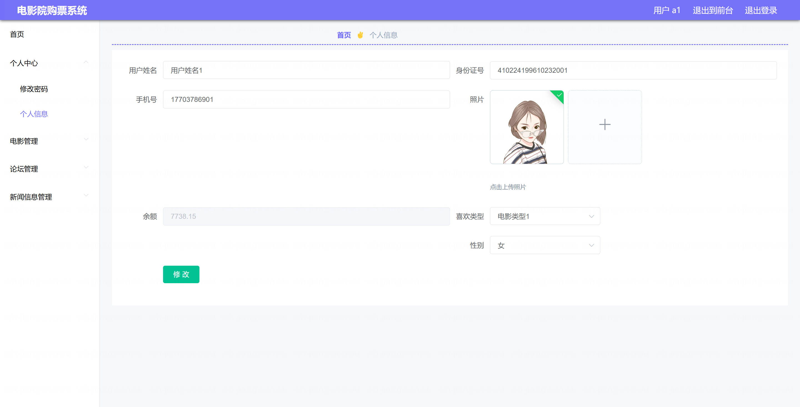
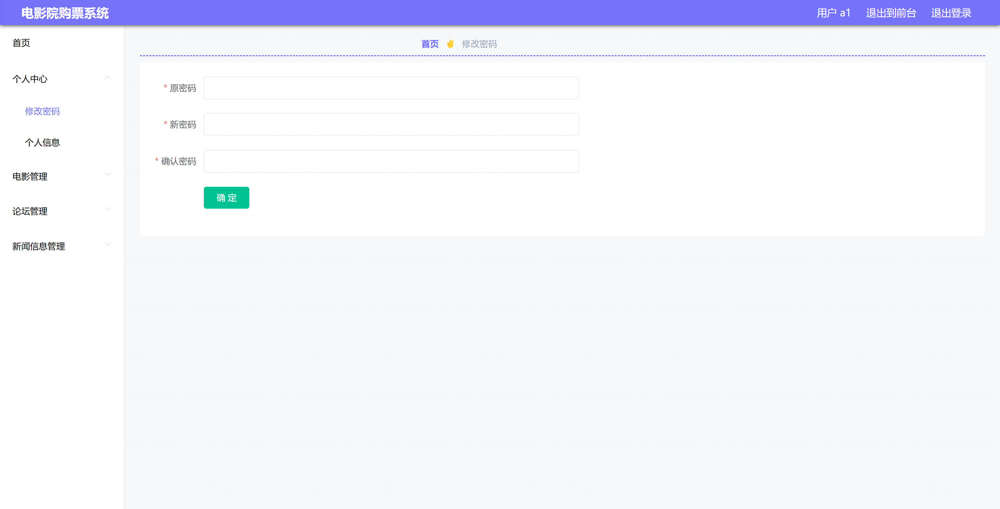
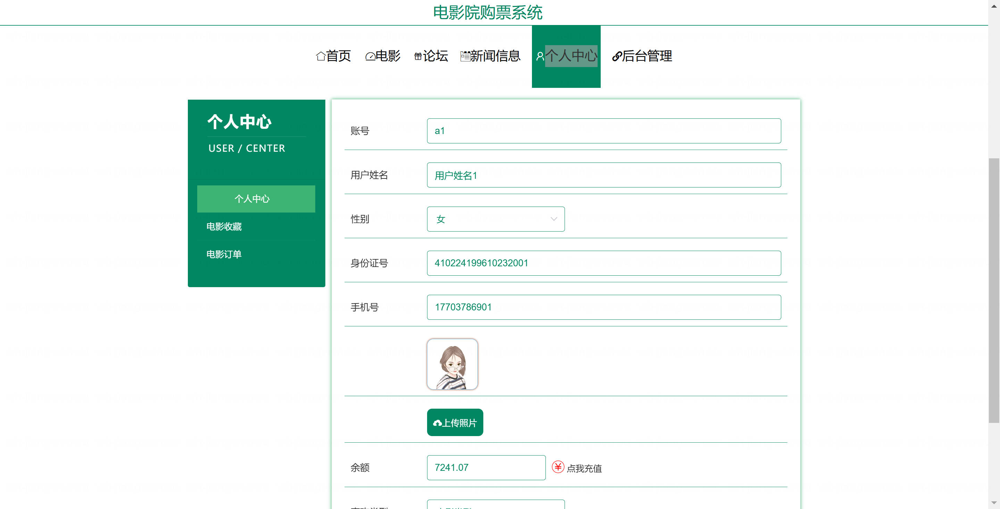
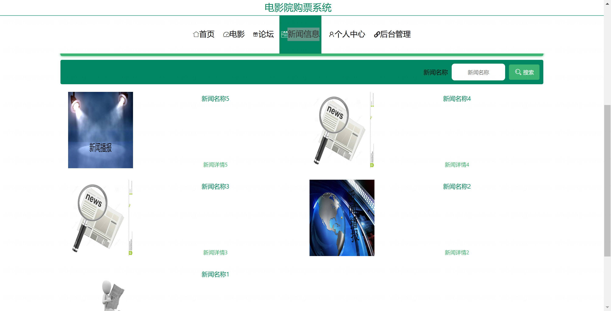

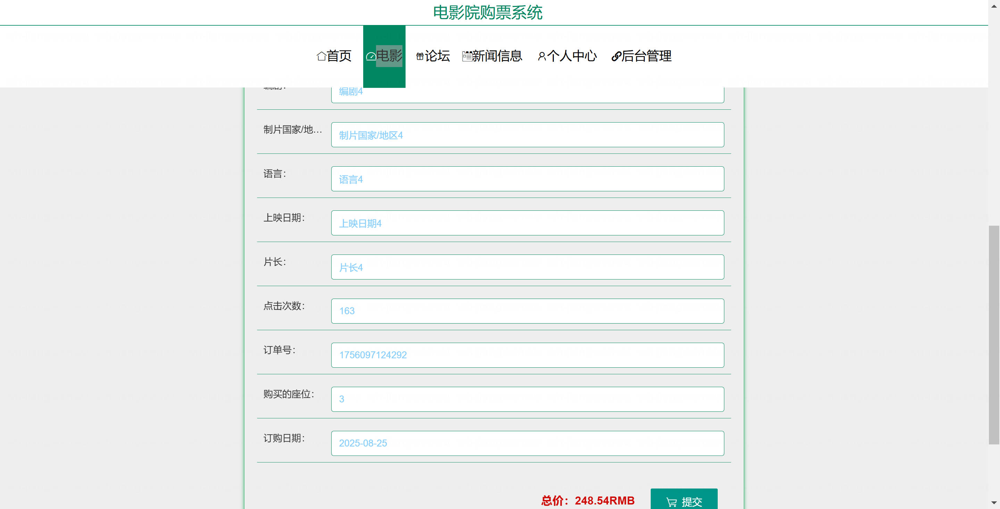
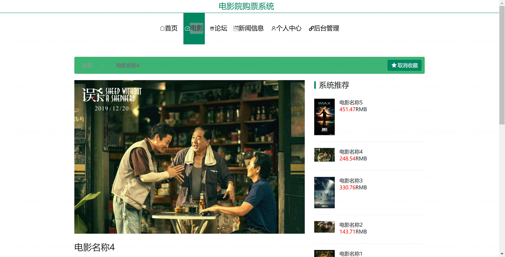
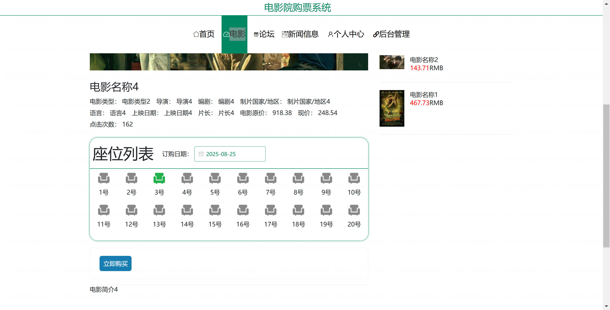
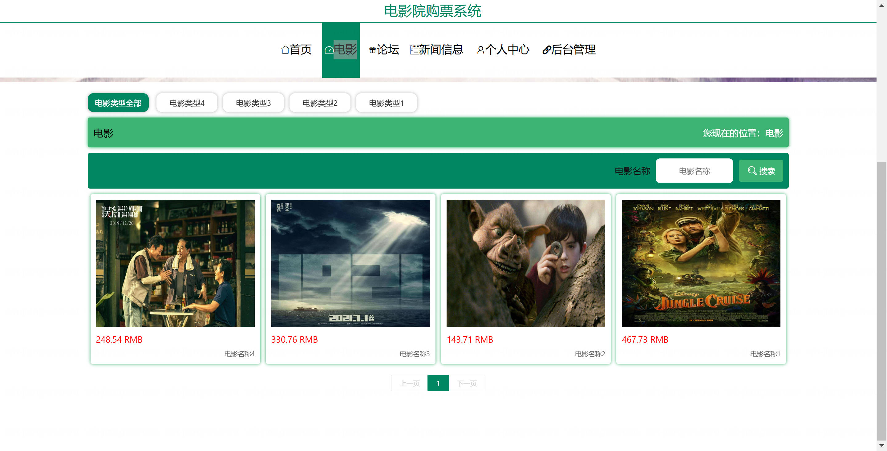

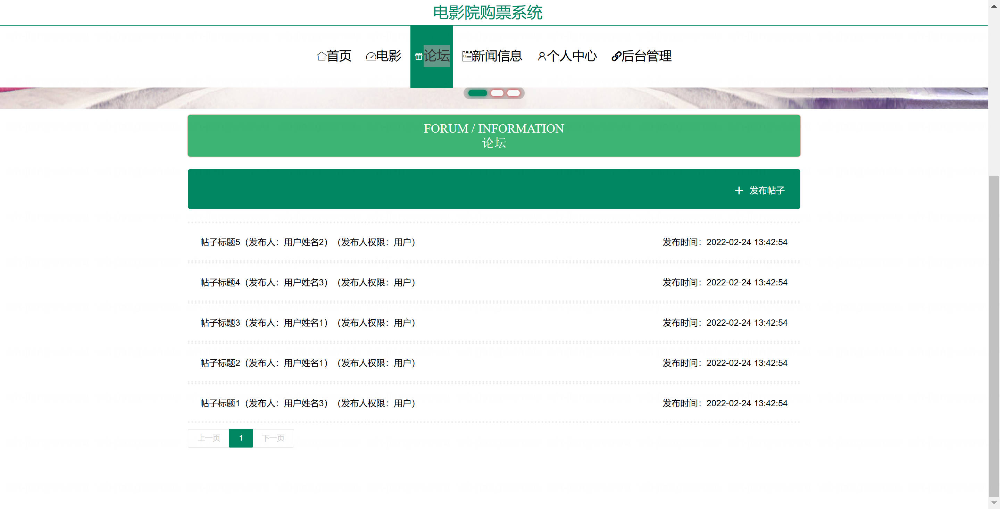
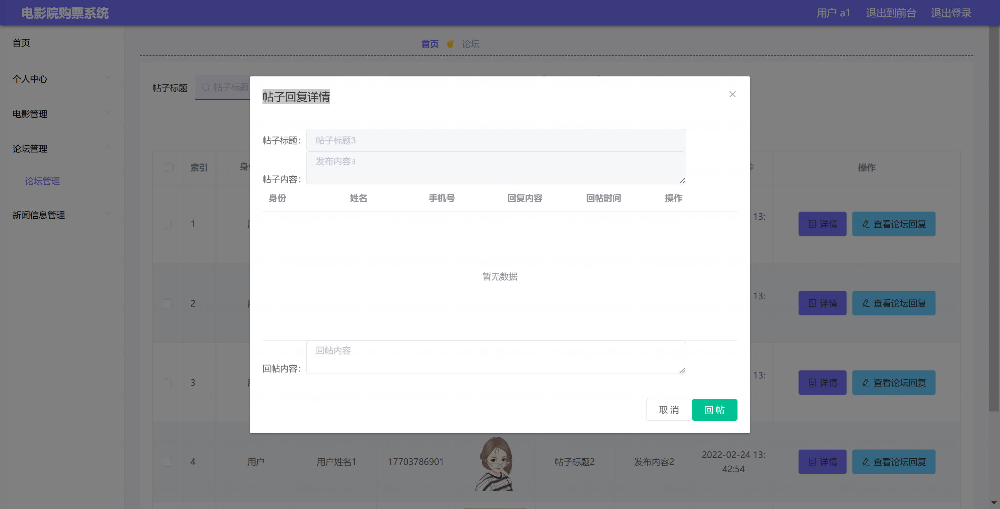
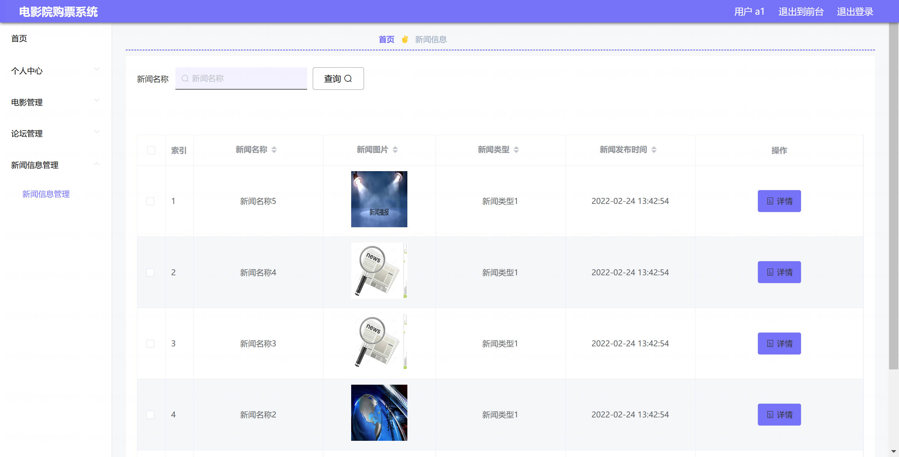
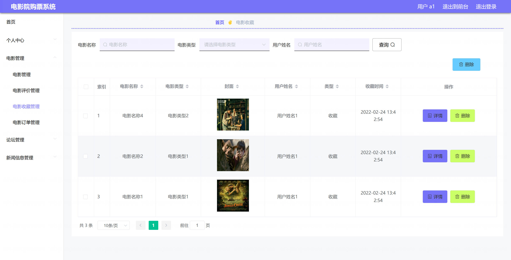
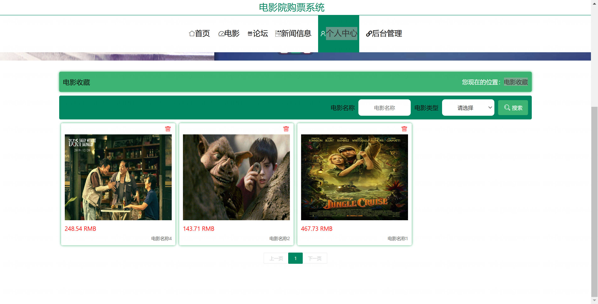

